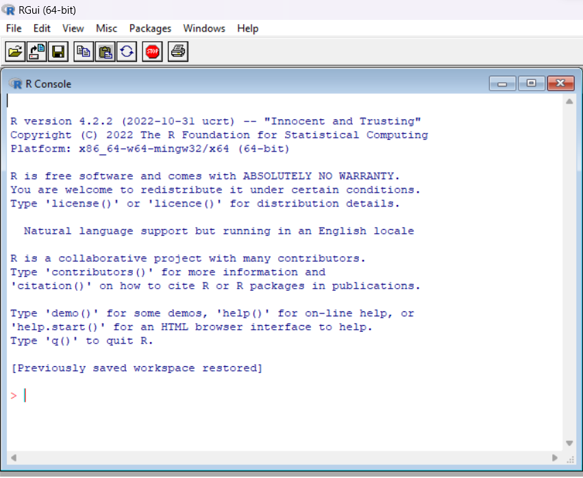
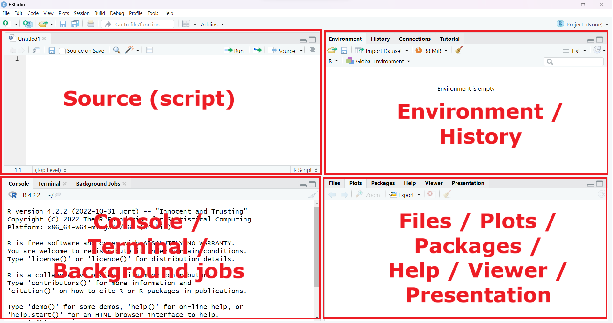
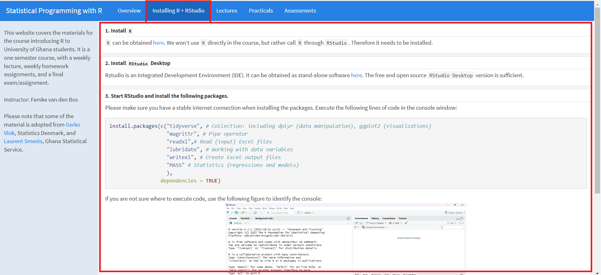
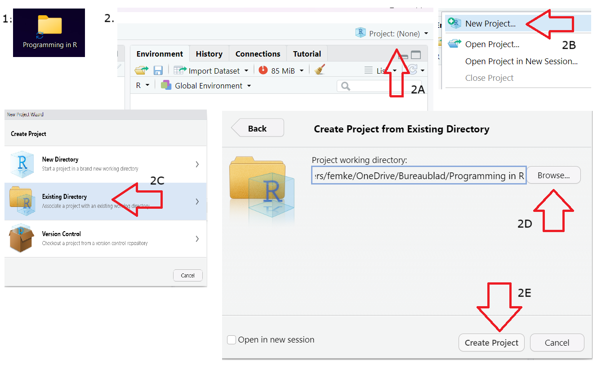
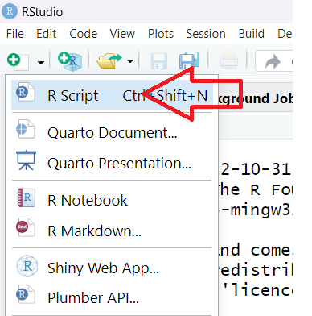
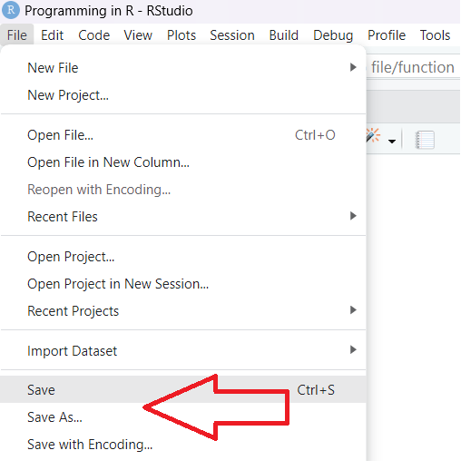
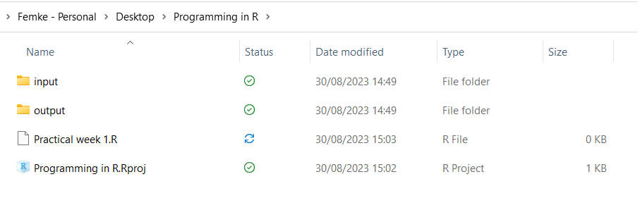

# Welcome to R for Data Analysis

# Outline of Lecture 1

## Outline of Lecture 1
- Introduction
- Overview of the course
- Explanation of assessment
- Explanation of R and RStudio
- Getting started in R!
- 

# Introduction

## Who am I?
- Femke van den Bos
- From The Netherlands 
- BSc and MSc in Econometrics and Operations Research @University of Groningen
- MSc in Economics for Development @University of Oxford
- Now ODI Fellow for Ghana Statistical Service
- My goals: 
  - Introducing you all to R
  - Teaching a new and useful skill
  - Motivating you to become a critical thinker
- I am always open for questions, feedback and critical discussions!

## Who are you?
- What are you expectations?
- What do you want to learn?
- What don't you want to learn?

## What are we going to learn?
- Foundations of R
- Importing + understanding data
- Data wrangling 
  - Tiyding data
  - Data manipulation
- Data visualization
- Data modelling
  - Simple linear regression
  - Multiple regression

Main goals:

- Basic understanding of R
- Skill to analyse data
- Critical thinking: what story does the data tell?

## What are we NOT going to learn?
- **Everything** you need to know about R
- Many different packages
  - You will learn them as you are using R
- Big data
- Time series and predictions
- Machine learning
- More advanced data science techniques

This course is an introduction to R: focused on teaching you how to **analyse data in R** and teaching critical thinking to **tell a story** with data.


## Overview of the course
- Weekly combination of lecture and practical
- Weekly assignment
- 8 weeks of core material
- One recap session
- Two presentation sessions (after the Christmas break)
- Final assessment

## Timeline
- Lecture: week 1-8 on Friday, 09:00-10:30 
  - Additional recap session in week 9
  - No planned session in other weeks, except when schedule has to be changed due to circumstances
- Practical: week 1-8 on Friday 10:30-12:00 (after lecture)
- Presentations: in the two weeks after the Christmas break
- Final assessment (Deadline = 2 February)

## Course schedule (1)
| Week  | Topic                               | 
|:------------|:------------------------------------|
| *Week 1* | Introduction to R |
| *Week 2*  | Foundations of R |
| *Week 3*  | Data Wrangling |
| *Week 4*  | Data Visualization (pt.1)|
| *Week 5* | Data Visualization (pt.2)|
| *Week 6*  | Guest Lecture: GSS Data Science Team |
| *Week 7* |  Introduction to Data Modelling in R |
| *Week 8* |  More on Data Modelling |
| *Extra* |  Time for rescheduling/recap/presentations |

## Assessment - Overview
- Case study using **GSS data**
  - Look at what the **Ghana Statistical Service** has available
  - Choose data that interests you
- Alongside the practical assignments you apply the new skills every week
- Group work: group of 2/3 people for the final assignment
- Individually work on the weekly assignments, but helping each other is encouraged
- Final outcomes:
  - 1: A report describing the data
  - 2: The code you used to write the report
  - 3: A presentation of your findings

## Assessment - Report
1: A report describing the data

  - Key = It should tell the *story* of the data
  - This may NOT include any code
  - Your friends and family should be able to understand this
  - Maximum of 15 pages
    - Front page, table of contents, introduction, methodology, data description, data analysis, conclusion, discussion
  - Not much text necessary, simply tables/figures with clear and concise descriptions
  - Longer reports are not necessarily better!
  - Emphasis should be on the quality of tables, figures, and regression analyses, showcasing the skills acquired during the course
  - **Minimum** of 5 different plots (towards 10 might be better)
  
## Assessment - R Code
2: The code you used to write the report

  - Folder containing R Project, R Script, and dataset used for the report
  - It should be a neatly written script, including comments, following the "tidyverse" styleguide
  - All code for the report should be included (reproducibility!)
  - And also, all code which you used to understand the data and to do checks on the data should be included

## Assessment - Presentation
3: A presentation of your findings

  - Concise summary of your main findings
  - No longer than 15 minutes
  - Prioritize the effective communication of the story the data tells
  - Conclusions should be drawn from the data
  - Any limitations encountered during the analysis should be discussed
  - No explanation of R code!

# Getting started!

# What is R?

## The origin of R
- R is a language and environment for statistical computing and for graphics
- GNU project (100% free software)

- Managed by the R Foundation for Statistical Computing, Vienna, Austria.

- Community-driven

- Based on the object-oriented language S (1975)

## Software
<center>

</center>

# What is RStudio?

## RStudio
- Aggregates all convenient information and procedures into one single place
- Allows you to work in projects
- Manages your code with highlighting
- Gives extra functionality (Shiny, knitr, markdown, LaTeX)
- Allows for integration with version control routines, such as Git.

## Integrated Development Environment
<center>

</center>

# Installing R and RStudio

## Installing R and RStudio
### The instructions to install R and RStudio can be found on the **course page**
<center>
  
</center>

## Scripts and comments
- You write your code in scripts in R (top-left)
- You can save your scripts, just like saving a Word document
- In your script you can make comments by using **#**
```{r}
# This is a comment
my_exam_grade <- 10 # I can also write a comment like this

# A comment makes the rest of the line be seen as a comment
# this_will_not_work <- 5
```

## Projects in R 
- When you use R you almost always first need to load your data into R
- To do this, R needs to know where to find the documents
- This can be described as your **working directorate**
- To make this easier, we will always work with projects in R:

  1. Make a folder on your computer (for example called: **Programming in R Course**)
  2. Create an R project in this folder
  3. Create a new R script for every practical
  4. Create an `input` and `output` folder to structure input and output files

## Creating a project
<center>

</center>

## Creating a script
<center>

</center>

## Saving a script
<center>

</center>

## What your folder should look like
<center>

</center>

# How does R work

## Objects and elements
- R works with objects that consist of elements. The smallest elements are numbers and characters.
    - These elements are assigned to objects. 
    - A set of objects can be used to perform calculations
    - Calculations can be presented as functions
    - Functions are used to perform calculations and return new objects, containing calculated (or estimated) elements. 

## Assigning elements to objects
- Assigning things in R is very straightforward: 
    - you just use `<-`

- For example, if you assign the value `100` (an element) to object `trotro_fare`, you would type

```{r}
trotro_fare <- 100
```

- Life hack: In RStudio learn to use the shortcut "alt + -" (hyphen) to produce the left arrow `<-` in an R file
- You run your line of code by Ctrl Enter, or by selecting run at the top right

## Calling objects
- Calling things in R is also very straightforward: 
    - you just use type the name you have given to the object

- For example, we assigned the value `100` to object `trotro_fare`. To call object `trotro_fare`, we would type

```{r}
trotro_fare
```

## Functions
- As explained, R works with functions
- You can make functions yourself
- Many people create functions and make them public, to be used by others
- There are also functions in the `base` package, which is installed for everyone

For example:
```{r}
# If we have 3 different trotro fares, we can make a vector of the fares
trotro_fares <- c(80, 80, 100)

# The function `mean` can then be used
mean(trotro_fares)
```
We are not going to learn a list of functions that exist, but during the course you will learn many different functions.

## Packages
- All functions that are made by others are packaged into packages
- The `base` package is installed automatically, and includes functions like `mean`
- Other packages can be extremely useful
- To use functions from other packages you **once** need to install the package
  - `install.packages("tidyverse")`
- After that you load the library to "activate" the package
  - `library(tidyverse)`
  - You load the libraries every time you restart R 

## The help
- Everything that is published on the Comprehensive `R` Archive Network (CRAN) and is aimed at `R` users, must be accompanied by a help file. 
- If you know the name of the function that performs an operation, e.g. `read_excel()`, then you just type `?read_excel` or `help(read_excel)` in the console and press enter.
- If you do not know the name of the function: type `??` followed by your search criterion. For example `??excel` returns a list of all help pages that contain the word 'excel'
- Alternatively, the internet will tell you almost everything you'd like to know (and then some)
- Sites such as http://www.stackoverflow.com and http://www.stackexchange.com, as well as `Google` can be of tremendous help. 
    - If you google `R` related issues; use 'R:' as a prefix in your search term
- `ChatGPT` and other chat bots can be super useful as well, as you can ask questions and follow with questions to understand codes
  - Be careful of just copying, try to actually learn from it

## How to approach the practicals
- First try to make the exercises yourself
- Use the help to identify the workings of functions
- Ask other students, work together, but make sure that everyone understands the code
- Use Google/ChatGPT
- Ask the lecturer/teaching assistant
- Do not be afraid to try!! Just write code and see if it works!
    
# End of Lecture 1
