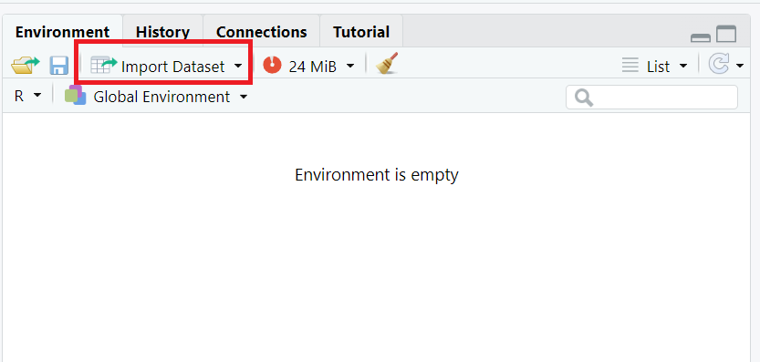

```{r setup, include = FALSE}
library(tidyverse)
library(lubridate)
```

# Recap of Last Week

## Recap Lecture 1
- Course overview
- Introduction to R
  - How to assign elements to objects (`<-`)
  - How to run code (Ctrl Enter)
  - How to save `R`-scripts
  - How to manage projects in `RStudio`
  - Introduction to objects, and assigning values

# Outline of Lecture 2

## Outline of Lecture 2
- Foundations of R
- Subsetting / calling elements
- Logical operators
- Extra tips
  - Code style
- Importing data
- Understanding data
- Joining datasets
- Exporting data

## Steps of Data Analysis
<center>

</center>

# Foundations of R

## Basic mathematics
- First of all, R can be used as a calculator

```{r}
1+1

(2*pi)/10
```

## Objects and assinging values
- Recap of last week
```{r}
# We can assign a value to a name (object)
name <- "Ama"
age <- 33

# We can evaluate objects
name
age
```

# Objects that contain more than one element

## More than one element
- Several elements of the same type, e.g. the integers from 1 to 5, can be put into a vector
```{r}
a <- c(1, 2, 3, 4, 5)
a
```

- As is typical for `R` there a several ways to accomplish this
```{r}
b <- 1:5
b
```

## Character vectors
Characters (or character strings) in `R` are indicated by the double quote identifier. 
```{r}
a.new <- c(a, "a")
a.new
```
Notice the difference with `a` from the previous slide
```{r}
a
```
Lessons: 

- Vectors are either numeric or character, and cannot have a combination of numeric and character elements.
- If letters/words are not in double quotes, R thinks it is an object that can be found in the environment.

## Multiple vectors in one object - Matrices
This we would refer to as a matrix
```{r}
c <- matrix(a, nrow = 5, ncol = 2)
c
```

## Matrices with mixed numeric and character data
If we add a character column to matrix `c`; everything becomes a character:
```{r}
cbind(c, letters[1:5])
```

Remember, matrices and vectors are numerical OR character objects. They can never contain both and still be used for numerical calculations. 

## Data frames
```{r}
d <- data.frame("Name" = c("Ama", "Kojo", "Nana"),
                "Age" = c(19, 34, 23), 
                "Height" = c(160, 175, 155))
d
```

We 'filled' a data frame with three names, their ages and their height in centimeters. 

Data frames can contain both numerical and character elements at the same time, although never in the same column. 

A modern alternative is a tibble, which is very similar to a data frame but just a bit more user-friendly.You make it by replacing `data.frame` by `tibble`.

## Beyond two dimensions
If you wish to use numerical objects that have more than two dimension, an array would be a suitable object. The following code yields a 3-dimensional array (2 rows, 4 columns and 3 matrices):
```{r}
e <- array(1:16, dim = c(2, 4, 2))
e
```

## Potential problem with array
If we replace the third matrix in the array by a character version of that matrix, we obtain
```{r}
e[, , 2] <- as.character(e[, , 2])
e
```
An array is a series of matrices, so characters and numerical elements may not be mixed, which is a major downside.

## Solution: a list
List are just what it says they are: lists. You can have a list of everything mixed with everything. 
For example, an simple list can be created by
```{r}
names <- c("Abena", "Kwame", "Jao", "Kobina", "Effia")
grades <- c(5, 8, 2, 7, 6, 9)
f <- list(names, grades)
f
```

# Random Numbers
## Random numbers
You can generate random numbers in R:
```{r}
# Random numbers between 1 and 100
sample(1:100, size=10, replace=TRUE)

# Set a seed to consistently get the same numbers
set.seed(123)
sample(1:100, size=10, replace=TRUE)

# You can also add probabilities
sample(c("succ", "fail"), 10, replace=T, prob=c(0.9, 0.1))
```

## Using distributions
```{r}
# Uniform distribution between 0 and 10
runif(10, 0, 10)

# Poisson distribution, lambda = 1
rpois(n = 10, lambda = 100)

```

# Subsetting / calling elements

## Calling elements in vectors
If we would want just the third element, we would type
```{r}
a
a[3]
```

## Calling elements in matrices
- The first row is called by
```{r}
c[1, ]
```

- The second column is called by
```{r}
c[, 2]
```

## Calling elements in matrices
- The intersection of the first row and second column is called by
```{r}
c[1, 2]
```

In short; square brackets [] are used to call elements, rows, columns (and much more beyond the scope of this course)

## Calling columns elements in data frames
There are 3 options to call a column in a data frame,
```{r}
d[, 2] # The 2nd column
d[, "Age"] # The column with as title Age 
d$Age
```
**Question:** Which method do you think is best to use?

## Indexing an array
The square bracket identification works similarly to the identification of matrices and dataframes, but with the added dimension(s). For example, 
```{r}
e[1, 3, 2]
```
yields the element in the first row of the third column in the second matrix. This is exactly the downside to an array: it is a series of matrices. 

In other words, characters and numerical elements may not be mixed. 

## Calling elements in lists
Calling the vector Names from the list can be done as follows
```{r}
f[[1]]
# We can give elements in a list names as well
names(f) <- c("Names", "Grades")
f[["Names"]]
```

Then the first element in the Names list can be called by:
```{r}
f$Names[1]
```

## Conclusion on subsetting
- Most often you will work with simple objects, vectors and data frames
- There are multiple ways to "call" elements, subsetting
  1. Square brackets `d[1,2]`
  2. Square brackets with row/column names `d[1, "Age]`
  3. Dollar signs for extracting columns `d$Age`
- Do not forget that R is case sensitive (that will give many frustrating errors)

# Logical operators

## Logical operators
- Logical operators are signs that evaluate a statement, such as `==`, `<`, `>`, `<=`, `>=`, and `|` (OR) as well as `&` (AND). Typing `!` before a logical operator takes the complement of that action. There are more operations, but these are the most useful. 

- For example, if we would like elements out of matrix `c` that are larger than 3, we would type:
```{r}
c[c > 3]
```

## Why does a logical statement on a matrix return a vector?
```{r}
c > 3
```
The column values for `TRUE` may be of different length. A vector as a return is therefore more appropriate. 

## Logical operators
- If we would like the elements that are smaller than 3 OR larger than 3, we could type
```{r}
c[c < 3 | c > 3] #c smaller than 3 or larger than 3
```
or
```{r}
c[c != 3] #c not equal to 3
```

## Logical operators
- In fact, `c != 3` returns a matrix 
```{r echo=FALSE}
c != 3
```
- Remember `c`?: 
```{r echo=FALSE}
c
```

# Other basics to know

## Things that cannot be done
- Things that have no representation in real number space (at least not without tremendous effort)
    - For example, the following code returns "Not a Number"
```{r}
0 / 0
```

- Also impossible are calculations based on missing values (NA's)
```{r}
mean(c(1, 2, NA, 4, 5))
```

## Standard solves for missing values
There are two easy ways to perform "listwise deletion":
```{r}
mean(c(1, 2, NA, 4, 5), na.rm = TRUE)
mean(na.omit(c(1, 2, NA, 4, 5)))
```

## Code style (1)
Good coding style is like correct punctuation: you can manage without it, butitsuremakesthingseasiertoread


Follow the tidyverse styleguide: https://style.tidyverse.org/


- Names: use lowercase letters, numbers and _ to seperate words
  - `university_of_ghana`, or `uog`, instead of `UniversityofGhana`
  - Be consistent!! And keep it short
  
## Code style (2)
- Put spaces on either side of mathematical operators apart from `^` (i.e. +, -, ==, <, …) and around the assignment operator (<-)
  - Like: `z <- (a + b)^2 / d` 
- Pipes (`%>%`) should always have a space on either side and be the last thing on the line (more later)
- Use comments (text preceded by `#`) to clarify what you are doing
    - If you look at your code again, one month from now: you will not know what you did --> unless you use comments 
    - It also helps others to understand your code
- Work with logically named `R`-scripts
    - Indicate the sequential nature of your work
- Work with `RStudio` projects

# Importing data

## Importing using the console/interface
- In your environment you can see the button Import Dataset
- We DO NOT recommend to use this
  - If you run your code again you might not remember which data to import
  - Other people cannot simply run your code when they have your folder with data
<center>

</center>

## Built in datasets
- There are certain datasets already preloaded in R for every user, they are in the `base` package
  - `ChickWeight`: data on weight if chicks, diet and feed conditions
  - `mtcars`: data on various car models, and some attributes
  - `iris`: a famous statistics dataset on iris flowers from three species
  - `AirPassengers`: a timeseries dataset on airline passengers over time

```{r}
summary(ChickWeight) # Quickly inspect it
```

## Your own data entry
- You already learnt to create your own objects
- So you can already make your own data
- Try to limit the amount of manual work you need to do!! Be lazy :)
  - Try to find if someone else has done the work before, for example making a list of country names and matching continents
- Often you will work with larger datasets and not with your own data entries
- If you make your own dataset, make sure you make a dataframe or tibble and not a matrix!

## Importing external data into R
Let's start with some general rules:

- You always need to tell R where to find the file in inverted commas " " and specifying the type of file by .xlsx for example
- We are working in projects mainly to ease importing data
- In the folder your project is in on your computer, you have a separate "input" folder
- All you data input has to be saved here!
- R will always look for the data at the exact place where the project is saved
- So you need to tell R to go into the input folder to find your data


Correct: `load("input/example_data.xlsx")`


Incorrect: `load(example_data)`

## R Data
- You can save your environment (save button in environment) as a .RData file
- This can be imported using `load("dataset.RData")`

## Excel data
- There are different functions that allow you to read Excel data into R
- `read_excel()` for .xlsx and .xls
- `read_csv()` for .csv files
- Both of these have many different arguments to help you!

```{r, eval = FALSE}
# For example the arguments sheet and skip, can you figure out what they do?
read_excel(path = "input/example_file.xlsx",
           sheet = "sheet_2",
           skip = 3)
```

## Detour: arguments of functions
- We are learning more and more functions, maybe without even realising it!
- Every function has inputs and the function creates the output, the inputs are the arguments
```{r}
# We already know the mean function
mean(c(1, NA, 3))
mean(c(1, NA, 3), na.rm = TRUE) # What extra argument do we use here?
```

## Detour continued
Now let's go back to out `read_excel` example:
```{r, eval = FALSE}
# What are the different arguments here?
read_excel(path = "input/example_file.xlsx",
           sheet = "sheet_2",
           skip = 3)
# What happens if we remove the left-hand side
read_excel("input/example_file.xlsx",
           sheet = "sheet_2",
           skip = 3)
```
- The order is very important!! `read_excel(3, "sheet_2", "input/example_file.xlsx")` does not work
- But `read_excel(skip = 3, sheet = "sheet_2", "input/example_file.xlsx")` does
- Often the left-hand side is left out for the first input, but ba careful in the order

## Other data types
- Basically all data formats can be loaded into R
  - Use Google, ChatGPT, or another source to help you figure out how!
- `read_sav()` for .sav
- `read.dta()` for .dta

# Understanding your data

## Source of your data
- Before even looking at your data, always check the source
  - Where did I get it from?
  - Would someone already manually made changes to the data?
  - If so, can I check what changes have already been made?
- Try to get raw data, and make any necessary changes yourself, such that you are in control of your data!

## How to look at your data?
1. Just type the name of your data in either your script of console and run it: `iris` - it will print in your console

Not useful for large datasets

2. Write `View(ChickWeight)` - the data opens in the data viewer window, which is super useful for a quick visual inspection

3. Instead of typing `View()` you can also click on the name in your environment - the advantage is that if someone else runs your code the data viewer window doesn't pop up

## First insights into your data
- Dimensions using `dim()` (or look in your environment!)
- Summary using `summary()`
- Glimpse using `glimpse()`
```{r}
# We need to load the `dplyr` package for the `glimpse` function
# library(dplyr)
dim(ChickWeight)
glimpse(ChickWeight) 
```

## More insights
Guess what these functions do!
```{r}
head(ChickWeight, 3)
min(ChickWeight$weight)
unique(ChickWeight$Diet)
```

## Be critical!
- I will repeat this a lot in this course: it is essential to be critical to be a good data analist
- Ask many questions!!
  - Do I understand what every column means?
  - Why do I see this in my data?
  - Does this number/value make sense?
- Can you think of an example of important questions to ask?
- If you notice strange things
  - Try to see if you find an explanation by going back to the source
  - Think about how to treat the data, context is super important
  - Do not simply drop missing values or outliers for example

# Joining datasets

## Row and column bind
- If two datasets have the exact same number of columns you can use `rbind(data_1, data_2)` to merge their rows together
  - When can you do this?
  - When can't you do this?
- If two datasets have the exact same number of rows you can use `cbind(data_1, data_2)` to merge their columns together
  - When can you do this?
  - When can't you do this?
- When can you use neither `rbind` nor `cbind`?

## More advanced joining of datasets
- If you want to join based on a certain column value we use 'join' functions
- Syntax: `join(df1, df2, by = "common_column")`
- Types of joins:`inner_join, left_join, right_join, full_join`
- Can you think of examples when this is useful?

# Exporting data

## Exporting data
- We learnt how to import data, but we can also export data again
- Why is this useful?
- Package: `writexl` (`install.packages("writexl")` and `library("writexl")`)
```{r eval = FALSE}
write_xlsx(my_data, "output/saved_data.xlsx")
```

# End of Lecture 2
