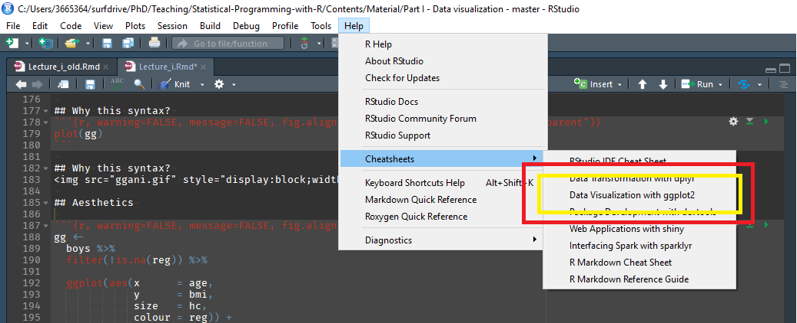

```{r setup, include = FALSE}
library(tidyverse)
```

# Recap of Last Week

## Recap Lecture 3
- What is data wrangling?
- Tidyverse package + pipe operator
- Tidying data
  - Renaming, dates and times, pivot longer and wider
- Data manipulation
  - Head, tail
  - Filter, select, arrange
  - Grouping, summarizing, mutating

# Outline of Lecture 4

## Outline of Lecture 4
- How to tell a story with data
  - 5 steps of data analysis
- Introduction into visualization
- Visualization in R
  - Base R graphs
  - `ggplot2`
  
## Steps of Data Analysis
<center>

</center>

# Story Telling with Data

## 5 Steps of Data Analysis
1. Ask
2. Collect and understand
3. Clean
4. Analyze
5. Tell your story

## 1. Ask
a.	What is the question your research will answer?
b.	Why is your data interesting?
c.	What do you think will be interesting things to show?
d.	Hypothesize: what story do I expect my data will tell
e.	What tables/figures do I think might be interesting to create? (without having looked at the data)

## 2. Collect and understand
a.	Collect the data
b.	Understand how the data is generated (very precisely)
c.	Understand what all the variables really mean
d.	Ask questions to yourself to check whether you fully understand every aspect of your data
e.	*Visualize* your data to get a feeling of what stories the data might tell

## 3. Clean
a.	Import the data into the program you will use for analyzing - `R`
b.	Perform checks on the data (missing values, outliers, summary statistics) 
c.	Question the outcome of all your checks, does any cleaning need to be done?
d.	Clean the data based on the careful analysis you did
e.	Make sure the data is in the correct format for you to analyze

## 4. Analyze
a.	Step away from your data and write a list of tables you want to create - Practical
b.	Step away from your data and draw rough sketches of the figures you want to create - Practical
c.	Do the first step data analysis: create simple summary statistics, as well as the first and easiest tables and figures - Practical
d.	Identify patterns and re-think which story you think the data tells, change / add to your list of tables and figures
e.	Do the next step of data analysis: play around with your data and create additional tables/figures based on the story that your data seems to tell, make sure to also play around with different ways of visualization

## 5. Tell your story
a.	Finalize your data analysis: create the final tables and visualizations that tell the story in the best way
b.	Choose which tables and figures to include and in which order
c.	Critically assess the way that you have presented your data: is it all correct, is it easy to understand, is there a story to be told?
d.	Draw conclusions, the story to be told is first of all what can be seen from the data and secondly what the following policy recommendations are
e.	Present the data in your report and make sure you are easily able to explain the main findings in 1 minute

# Application of the 5 Steps of Data Analysis

## Applying the 5 Steps
- Can you apply these 5 steps to your own project?
  - Ask
  - Collect and understand
  - Clean
  - Analyze
  - Tell your story
- Which steps have you taken?
- Which steps have you not yet taken?
- What have you learnt from these 5 steps?

# Introduction into Visualization

## Introduction into visualization
- Importance of vizualization
- In which steps do you use visualizations?
- Exploratory graphs
- Illustrative graphs
- What type of graphs are you going to make?
- What type of graphs will be in your report/presentation?

## Why Visualize?
</img>

<p style="text-align:center;font-style:italic;font-size:0.5em;">Source: https://www.autodeskresearch.com/publications/samestats</p>

## Exploratory graphs
- Understanding your data
- Describing data
- Detect patterns
- Validation checks on data
- Use for yourself / internally

## Illustrative graphs
- Illustrating a conclusion
- Telling a story with the data
- For publication / to share
- Require more effort!
  - Axis titles
  - Labels
  - Colors
  - etc.
  
# Visualization in R

## Graphical Systems in R
- Standard graphics package - in `base R`
- `ggplot2` package

## Base R
- Not going to use this much
- Very basic package for visualizations
- Often easier + more convenient to use `ggplot2`!

## Histogram in base R
```{r, fig.align='center', dev.args=list(bg="transparent"), warning=FALSE, message=FALSE}
hist(ChickWeight$weight)
```

## Boxplot in base R
```{r, fig.align='center', dev.args=list(bg="transparent"), warning=FALSE, message=FALSE}
boxplot(weight ~ Diet, data = ChickWeight)
```

## Scatterplot in base R
```{r, fig.align='center', dev.args=list(bg="transparent"), warning=FALSE, message=FALSE}
plot(x = ChickWeight$Time, y = ChickWeight$weight)
```

## Different Types of Charts
https://r-graph-gallery.com/

- Many different types of graphs
- Important to choose the most suitable type
- Try different types to see what works for your data

# `Ggplot2`

## Introduction to `ggplot2`
Layered plotting based on the book **The Grammar of Graphics** by Leland Wilkinsons.

With `ggplot2` you

1. provide the _data_
2. define how to map variables to _aesthetics_
3. state which _geometric object_ to display
4. (optional) edit the overall _theme_ of the plot

`ggplot2` then takes care of the details

## `ggplot`
```{r, fig.align='center', dev.args=list(bg="transparent"), warning=FALSE, message=FALSE}
ggplot()
```

## Data
```{r, fig.align='center', dev.args=list(bg="transparent"), warning=FALSE, message=FALSE}
ggplot(ChickWeight)
```

## Aesthetics
```{r, fig.align='center', dev.args=list(bg="transparent"), warning=FALSE, message=FALSE}
ggplot(ChickWeight, aes(x = Time, y = weight))
```

## Geometric object
```{r, fig.align='center', dev.args=list(bg="transparent"), warning=FALSE, message=FALSE}
ggplot(ChickWeight, aes(x = Time, y = weight)) + 
  geom_point()
```

## General Rules for `ggplot`
ggplot(data = DATA, mapping = aes(MAPPINGS)) +
   GEOM_FUNCTION()

Add layers with +

Put + at the end of a line

Map aesthetics with aes()

## Additional Layers
```{r, fig.align='center', dev.args=list(bg="transparent"), warning=FALSE, message=FALSE}
extra_layer <- ggplot(ChickWeight,
       aes(x = Time, 
           y = weight)) +
  geom_point() +
  geom_smooth(color = "blue") +
  labs(x = "Time", y = "Weight", title = "Chick weight over time") +
  theme_minimal()
```

## Additional Layers
```{r, warning=FALSE, message=FALSE, fig.align='center', dev.args=list(bg="transparent")}
plot(extra_layer)
```

## More advanced plots
```{r, fig.align='center', dev.args=list(bg="transparent"), warning=FALSE, message=FALSE}
more_advanced_plot <- ggplot(ChickWeight,
       aes(x = Time, 
           y = weight,
           color = Diet)) +
  geom_point(alpha = 0.5) +
  labs(x = "Time", y = "Weight",
       color = "Diet", title = "Chick weight over time by diet") +
  theme_minimal()
```
There are many different types of plot you could make! Can you think of more?

## More advanced plots
```{r, warning=FALSE, message=FALSE, fig.align='center', dev.args=list(bg="transparent")}
plot(more_advanced_plot)
```

## Aesthetics

- x
- y
- size
- colour
- fill
- opacity (alpha)
- linetype
- ...

## New dataset: boys
```{r, warning=FALSE, message=FALSE}
library(mice)     # Boys dataset
glimpse(boys)
```

## New dataset: boys
```{r}
summary(boys)
```

## New dataset: boys
```{r}
head(boys, 3)
tail(boys, 3)
```

## Aesthetics
```{r, warning=FALSE, message=FALSE, fig.align='center', dev.args=list(bg="transparent")}
gg <- 
  boys %>% 
  filter(!is.na(reg)) %>% 
  
  ggplot(aes(x      = hgt, 
             y      = wgt, 
             shape  = reg, 
             colour = age)) +
  
  geom_point( alpha = 0.5) +
  
  labs(title  = "Trend for boys",
       x      = "Height", 
       y      = "Weight", 
       shape    = "Region",
       colour = "Age") +
  theme_minimal()
```
 
## Aesthetics
```{r, warning=FALSE, message=FALSE, fig.align='center', dev.args=list(bg="transparent")}
plot(gg)
```

## Geoms

- geom_point
- geom_bar
- geom_line
- geom_smooth
- geom_histogram
- geom_boxplot
- geom_density

## Geoms: Bar
```{r, echo=FALSE, warning=FALSE, message=FALSE, fig.align='center', dev.args=list(bg="transparent")}
data.frame(x = letters[1:5], y = c(1, 3, 3, 2, 1)) %>% 
  ggplot(aes(x = x, y = y)) + 
  geom_bar(fill = "dark green", stat = "identity") +
  labs(title = "Value per letter",
       x     = "Letter", 
       y     = "Value") +
  theme_minimal()
```

## Geoms: Line
```{r, echo=FALSE, warning=FALSE, message=FALSE, fig.align='center', dev.args=list(bg="transparent")}
ggdat <- data.frame(x = 1:100, y = rnorm(100))
ggdat %>% 
  ggplot(aes(x = x, y = y)) + 
  geom_line(colour = "dark green", lwd = 1) +
  ylim(-2, 3.5) +
  labs(title = "Some line thing",
       x     = "Time since start", 
       y     = "Some value") +
  theme_minimal()
```

## Geoms: Smooth
```{r, echo=FALSE, warning=FALSE, message=FALSE, fig.align='center', dev.args=list(bg="transparent")}
ggdat %>% 
  ggplot(aes(x = x, y = y)) + 
  geom_smooth(colour = "dark green", lwd = 1, se = FALSE) +
  ylim(-2, 3.5) +
  labs(title = "Some line thing",
       x     = "Time since start", 
       y     = "Some value") +
  theme_minimal()
```

## Geoms: Boxplot
```{r, echo=FALSE, warning=FALSE, message=FALSE, fig.align='center', dev.args=list(bg="transparent")}
boys %>% 
  filter(!is.na(reg)) %>% 
  
  ggplot(aes(x = reg, y = bmi, fill = reg)) +
  
  geom_boxplot() +
  
  labs(title = "BMI across regions",
       x     = "Region", 
       y     = "BMI") +
  theme_minimal() + 
  theme(legend.position = "none")
```

## Facets 

`facet_wrap()` and `facet_grid()` divide figures into panels.

```{r, eval=FALSE}
boys %>%
  ggplot(aes(x = age, y = bmi)) +
  geom_point() +
  geom_smooth() + 
  facet_wrap(~ reg)
```

## Facets 

```{r, warning=FALSE, message=FALSE, echo=FALSE}
boys %>%
  ggplot(aes(x = age, y = bmi)) +
  geom_point() +
  geom_smooth() + 
  facet_wrap(~ reg)
```

## Export Figures

Easy with `ggsave()`

```{r, eval=FALSE}
# save as pdf
ggssave("plot.pdf", myplot)

# save as png and specify dimensions 
ggssave("plot.png", myplot, width = 7, height = 5, units="in")
```

## Helpful link in RStudio
</img>

## Additional Resources
- R for Data Science
- DataCamp: ggplot 2 courses
- ggplot2: Elegant Graphics for Data Analysis (the official ggplot2 book)

## Data Visualization Principles 
- Simplify and focus
- Increase your text size
- Avoid pie charts, use bar charts
- Avoid line drawings, use fill/color
- Stay 2D

# End of Lecture 4