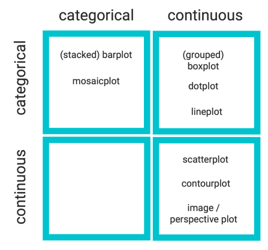

```{r setup, include = FALSE}
library(tidyverse)
```

# Recap of Last Week

## Recap Lecture 4
- How to tell a story with data
  - 5 steps of data analysis
- Introduction into visualization
- Visualization in R
  - Base R graphs
  - `ggplot2`

# Outline of Lecture 5

## Outline of Lecture 5
- Recap: How to tell a story with data
  - 5 steps of data analysis
- More Advanced Figures 
- Tips
- Examples

## Steps of Data Analysis
<center>

</center>

# Recap: Telling a Story with Data
## 5 Steps of Data Analysis
1. Ask
2. Collect and understand
3. Clean
4. Analyze
5. Tell your story

## Progress
- What progress have you made?
- What is your progress since last week?
- Have you made visualizations in R?
- Sit in groups and discuss figures you have made
  - What is the figure showing?
  - How could it be improved?

# More Advanced Figures 

## What would you like to learn?

## What are additional things you could learn?
- How to choose which graph to use
- Learn new types of graphs
- Themes (make graphs prettier)

## How to choose which graph to use
- Try different graphs
- Trial and error
- Critical thinking
- Look at other resources and what graphs they use

## Choosing a graph
<center>

</center>

## Five named graphs
|     | Named graph  | Shows    | Geometric object  | Notes   |
|-----|--------------|--------------------------------|-----------------------------------|-------------------------------------------------|
|1  | Scatterplot | Relationship between 2 numerical variables  | `geom_point()` | |
|2 | Linegraph | Relationship between 2 numerical variables  | `geom_line()` |  Used when there is a sequential order to x-variable, e.g., time | 
|3  | Histogram| Distribution of 1 numerical variable        | `geom_histogram()` | Facetted histograms show the distribution of 1 numerical variable split by the values of another variable |
| 4  | Boxplot    | Distribution of 1 numerical variable split by the values of another variable  | `geom_boxplot()` | |
|5  | Barplot   | Distribution of 1 categorical variable      | `geom_bar()` when counts are not pre-counted, `geom_col()` when counts are pre-counted  | Stacked, side-by-side, and faceted barplots show the joint distribution of 2 categorical variables |

## Learn new types of graphs
- Use https://r-graph-gallery.com/
- Google
- ChatGPT
- Ask others (classmates, teaching assistant, lecturers)
- Be creative and search for the graph you want to create

# Themes 
## R Themes
|Themes | Description |
|-----|----------------------- |
|theme_bw() | white background with grid lines|
|theme_grey() |grey background and white grid lines (default)|
|theme_classic() |white background and no grid lines|
|theme_minimal() |minimal theme with no background annotations|
|theme_linedraw() |black lines of various widths on white backgrounds|
|theme_light()| light grey lines and axes|

And you can create your own theme!

## Your own theme
```{r}
plot_with_theme <- ggplot(ChickWeight,
       aes(x = Time, 
           y = weight,
           color = Diet)) +
  geom_point() +
  theme(text = element_text(colour="red",
                            size=20),
        panel.grid.major.y=element_line(color="gray", size=0.25),
        panel.grid.major.x=element_blank(),
        panel.grid.minor=element_blank(),
        panel.background=element_rect(fill="white", color=NA),
        plot.background=element_rect(fill="white", color=NA),
        legend.background=element_rect(fill="white", color=NA),
        legend.position = "bottom"
        )
```

## Your own theme
```{r}
plot_with_theme
```

# Tips

## Practice makes perfect
- Always make a sketch on a piece of paper before programming
- Do not be afraid to try new things in R
- Try to make figures and see what does and does not work
- It is a step by step learning process
- Focus on practicing and being critical
- Work together and learn from each other

# Examples

## New data
Source: https://r4ds.hadley.nz/data-visualize
```{r, message = FALSE, warning = FALSE}
library(palmerpenguins) # First: install.packages("palmerpenguins")
library(ggthemes) # First: install.packages("ggthemes)

summary(penguins)
```

## Example graph 1
```{r}
example_graph_1 <- ggplot(
  data = penguins,
  mapping = aes(x = flipper_length_mm, y = body_mass_g)
) +
  geom_point(aes(color = species, shape = species)) +
  geom_smooth(method = "lm") +
  labs(
    title = "Body mass and flipper length",
    subtitle = "Dimensions for Adelie, Chinstrap, and Gentoo Penguins",
    x = "Flipper length (mm)", y = "Body mass (g)",
    color = "Species", shape = "Species"
  ) +
  scale_color_colorblind()
```

## Example graph 1
```{r}
example_graph_1
```

## Example graph 2
```{r}
example_graph_2 <- ggplot(penguins, 
                          aes(x = body_mass_g, 
                              color = species, 
                              fill = species)) +
  geom_density(alpha = 0.5)
```

## Example graph 2
```{r}
example_graph_2
```

## Example graph 3
```{r}
example_graph_3 <- ggplot(penguins, 
                          aes(x = island, 
                              fill = species)) +
  geom_bar(position = "fill")
```

## Example graph 3
```{r}
example_graph_3
```

## Example graph 4
```{r}
example_graph_4 <- ggplot(penguins, 
                          aes(x = island, 
                              fill = species)) +
  geom_bar(position = "stack")
```

## Example graph 4
```{r}
example_graph_4
```

## Example graph 5
```{r}
example_graph_5 <- ggplot(penguins, 
                          aes(x = island, 
                              fill = species)) +
  geom_bar(position = "dodge")
```

## Example graph 5
```{r}
example_graph_5
```

# Todays Session

## Todays session
- Make sketches of graphs you want to make
- Try to make figures using your data
- Try to use other data to make figures
- Find new types of graphs to make
- Make your existing graphs prettier
- Focus on learning by doing

# End of Lecture 5