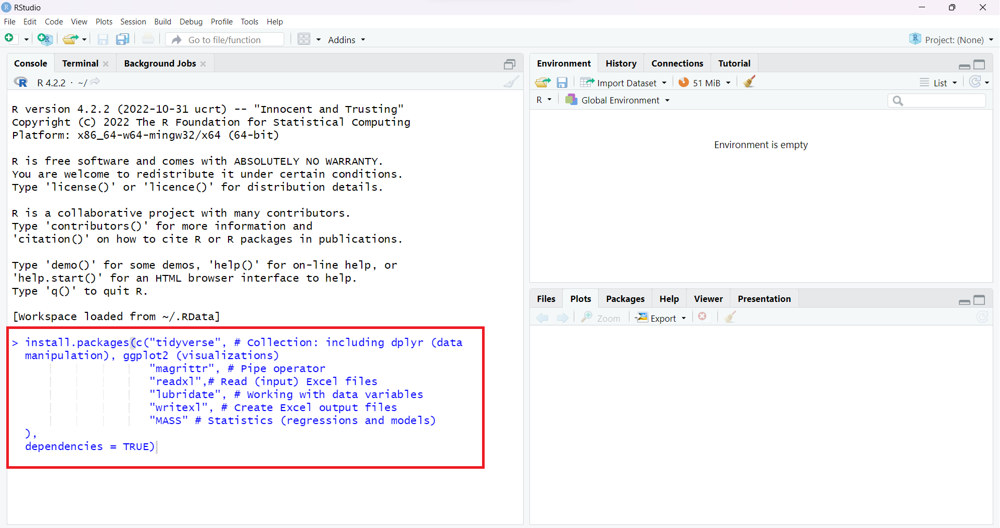

<!-- ```{r setup, include=FALSE} -->
<!-- knitr::opts_chunk$set(echo = TRUE) -->
<!-- library(vembedr) -->

<!-- ``` -->

# Intro {.sidebar}

This website covers the materials for the course R for Data Analysis for University of Ghana students. It is a one semester course, with a weekly lecture, weekly homework assignments, and a final assignment and presentation.

---

<strong>Instructors: </strong>

[Femke van den Bos](femke.bos@statsghana.gov.gh)

[Edem Titriku](edem.titriku@statsghana.gov.gh)

<strong>Teaching assistants:</strong>

Foster Agyare Okyere

Joshua Mawutor

---

Please note that some of the material is adopted from [Steffen Eriksen](https://www.youtube.com/c/SteffensClassroom) (University of Groningen), [Laurent Smeets](https://github.com/Laurent-Smeets-GSS-Account/RGhana) (Ghana Statistical Service), [Gerko Vink](https://github.com/gerkovink/R) (Statistics Denmark), [Stan Koobs](https://www.eur.nl/en/people/stan-koobs) (University of Rotterdam), and online resources.

---
# Overview

## Column 1

### Outline
Welcome to our R for Data Analysis Course! 

This comprehensive program will take you from R novice to a skilled data analyst. You'll start by mastering the foundations of R, move on to importing and understanding data, become proficient in data wrangling (including tidying data and data manipulation), learn the art of data visualization, and finally, explore data modeling. 

Our main goals are to provide you with a solid understanding of R, equip you with data analysis skills, and foster critical thinking to uncover the stories hidden within your data. During the course, you'll get the chance to use real-world data from the Ghana Statistical Service (GSS) in a practical case study. Whether you're new to R or already have some experience, this course is tailored to help you excel in the field of data analysis.


## Column 2

### Course schedule 
| Week  | Day | Time      | Topic                               | 
|:----------|:-------------------------|:--------------|:------------------------------------|
| *Week 1* |Friday - October 20 |9:00-12:00 | Introduction to R |
| *Week 2* |Friday - October 27 |9:00-12:00 | Foundations of R |
| *Week 3* |Friday - November 3 |9:00-12:00 | Data Wrangling |
| *Week 4* |Friday - November 10 |9:00-12:00 | Data Visualization (pt.1) |
| *Week 5* |Day TBD |9:00-12:00 | Data Visualization (pt.2) |
| *Week 6* |Friday - November 24 |9:00-12:00 | Introduction into Data Modelling in R |
| *Week 7* |Day TBD |9:00-12:00 | More on Data Modelling |
|  |Friday - December 8 |9:00-12:00 | Time for working on the report / catching up |
| *Recap* |Friday - December 15 |9:00-12:00 | Recap Lecture + Assistance with Report |
| |Friday - December 22 |9:00-12:00 | Time for working on the report |
|  | *Christmas break!*  |    |    | 
| *Presentations * |Friday - January 12 |9:00-12:00 | Presentations (pt.1) |
| *Presentations * |Friday - January 19 |9:00-12:00 | Presentations (pt.2) |


# Installing R + RStudio

## Column 1

### **1. Install `R`**
`R` can be obtained [here](https://cran.r-project.org). We won't use `R` directly in the course, but rather call `R` through `RStudio`. Therefore it needs to be installed.

### **2. Install `RStudio` Desktop**
Rstudio is an Integrated Development Environment (IDE). It can be obtained as stand-alone software [here](https://www.posit.co/downloads/). The free and open source `RStudio Desktop` version is sufficient.

### **3. Start RStudio and install the following packages. **
Please make sure you have a stable internet connection when installing the packages. Execute the following lines of code in the console window:
```{r eval=FALSE, echo = TRUE}
install.packages(c("tidyverse", # Collection: including dplyr (data manipulation), ggplot2 (visualizations) 
                   "magrittr", # Pipe operator
                   "readxl",# Read (input) Excel files
                   "lubridate", # Working with data variables
                   "writexl", # Create Excel output files
                   "MASS" # Statistics (regressions and models)
                   ), 
                 dependencies = TRUE)
```

If you are not sure where to execute code, use the following figure to identify the console:
<center>
  
</center>
Just copy and paste the installation command and press the return key. When asked 

```{r eval = FALSE, echo = TRUE}
Do you want to install from sources the package which needs 
compilation? (Yes/no/cancel)
```

type `Yes` in the console and press the return key. 

# Lectures

## Column 1

### Lecture Slides
Here you can find all the lecture slides. Please note that the first page of the slides shows the date on which the slides were last updated. We adapt the course as we go. To ensure that you work with the latest iteration of the course materials, we advice all course participants to access the materials online.

- [Lecture 1 - Introduction to R](Contents/Lectures/Week 1/Lecture_week_1.html){target="_blank"}
- [Lecture 2 - Foundations of R](Contents/Lectures/Week 2/Lecture_week_2.html){target="_blank"}
- [Lecture 3 - Data Wrangling](Contents/Lectures/Week 3/Lecture_week_3.html){target="_blank"}
- [Lecture 4 - Data Visualization (pt.1)](Contents/Lectures/Week 4/Lecture_week_4.html){target="_blank"}
- [Lecture 5 - Data Visualization (pt.2)](Contents/Lectures/Week 5/Lecture_week_5.html){target="_blank"}
- [Lecture 6 - Introduction into Modelling in R](Contents/Lectures/Week 6/Lecture_week_6.html){target="_blank"}
- [Lecture 7 - More on Data Modelling](Contents/Lectures/Week 7/Lecture_week_7.html){target="_blank"}

## Column 2

### Useful References
The following links are useful references that connect to the material: 

- [Steffen's Classroom (YouTube videos)](https://www.youtube.com/playlist?list=PLn6B3DUkuU_1iUUe008rXIjG_t3IyzoM3)
- [`R` for Data Science (2nd edition)](https://r4ds.hadley.nz/)
- [Statistical Inference via Data Science](https://moderndive.com/index.html)
- [Advanced R](https://adv-r.hadley.nz/)
- [R Programming for Data Science](https://bookdown.org/rdpeng/rprogdatascience/)
- [The Tidyverse Style Guide](https://style.tidyverse.org)
- [Datacamp Tutorial on Pipes](https://www.datacamp.com/tutorial/pipe-r-tutorial)
- [The `ggplot2` Reference Package](https://ggplot2.tidyverse.org/reference/)
- [R Graph Gallery](https://r-graph-gallery.com/index.html)
- [Timeseries Presentation](https://gss-datascience-training.netlify.app/content/slides/time_series/time_series#/title-slide)

# Assignments

## Column 1

### Assignments
Here you can find the assignments for the weekly homework assignments. Please note that these might also be adapted as we go, so make sure you use the most recent file when working on them.

The deadline for each assignment is before the next lecture!

- [Assignment 1 (Deadline: Thursday 26-10-2023)](Contents/Assignments/Week 1 Assignment.pdf)
- [Assignment 2 (Deadline: Thursday 02-11-2023)](Contents/Assignments/Week 2 Assignment.pdf)
- [Assignment 3 (Deadline: Thursday 09-11-2023)](Contents/Assignments/Week 3 Assignment.pdf)


### Data
The data that should be used for the assignments can be found here.

- [2021 PHC - Education Data](Contents/Assignments/data/education.xlsx)
- [2021 PHC - Housing Data](Contents/Assignments/data/housing.xlsx)
- [2021 PHC - Population Data](Contents/Assignments/data/population.xlsx)

## Column 2

### Solutions to Assignments
After the weekly deadline, the solution to the assignment will be uploaded here. (This will be after the following lecture.)

- [Solution Assignment 1](Contents/Assignments/Assignment-Week-One-Solutions.html){target="_blank"}

# Assessment

## Final Assessment
The instructions to the final assessment can be found here, along with required data sets.

- [Final Assessment - Instructions](Contents/Assessments/Instructions_final_assessment.pdf)
- [Final Assessment - Groups](Contents/Assessments/Groups_final_assessment.pdf)

